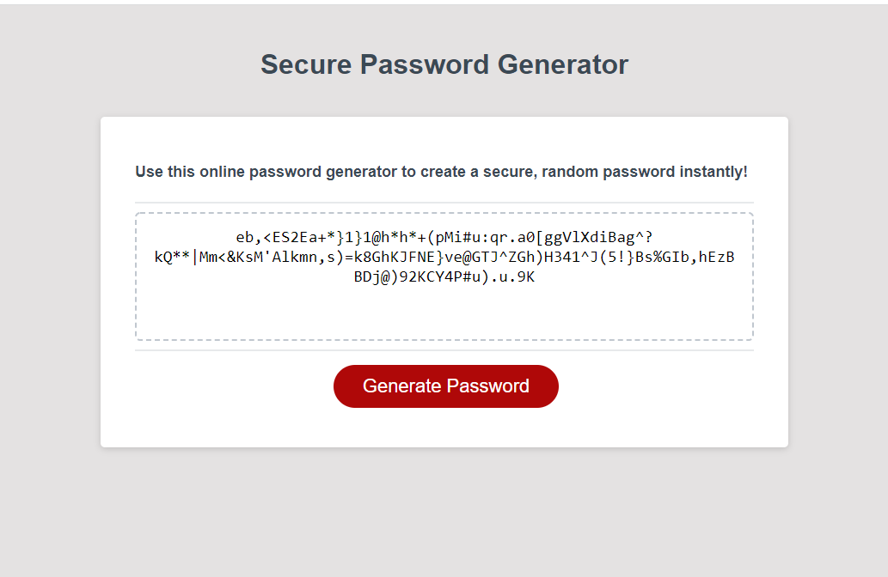

# Secure-Password-Generator

## Description

Secure Password Generator is an application that enables employees to generate random passwords instantly, based on specific criteria. This application has a clean and polished, responsive user interface that adapts to multiple screen sizes.

## Table of Contents

  - [Description](#description)
  - [Installation](#installation)
  - [Usage](#usage)
  - [Technologies](#technologies)
  

## Installation

For an easy installation experience, just Clone the Secure-Password-Generator repository to your PC. If you want to explore this application a bit further, just clink on the link below to see it in the browser.

## Usage

To use this application, just open in the browser, click on the "Generate Password" button and answer the automatically generated questions to specify the length and characters to be included in your password.

    ```md
    
    ```

## Technologies

1. HTML
2. CSS
3. Java Script 


## Link

